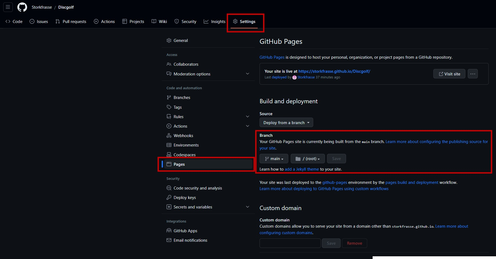
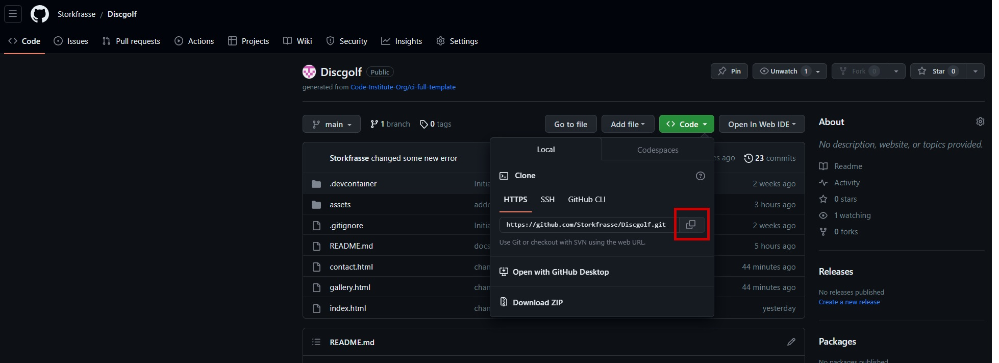

# **Discgolf**

Discgolf is my big hobby and i made this site to spread the sport. The site is targeted at the regular person who is looking for an new sport to try out.
I wanted the website to be as simple and nice as i could.

Welcome to <a href="https://storkfrasse.github.io/Discgolf/index.html" target="_blank" rel="noopener">Discgolf</a>

# Contents

- [**Discgolf**](#discgolf)
- [Contents](#contents)
- [User Experience](#user-experience)
  - [User Stories](#user-stories)
  - [Site Structure](#site-structure)
  - [Design Choices](#design-choices)
- [Features](#features)
  - [Existing Features](#existing-features)
  - [Future Features](#future-features)
- [Technologies Used](#technologies-used)
- [Testing](#testing)
- [Deployment](#deployment)
    - [**To deploy the project**](#to-deploy-the-project)
    - [**To fork the repository on GitHub**](#to-fork-the-repository-on-github)
    - [**To create a local clone of this project**](#to-create-a-local-clone-of-this-project)
- [Credits](#credits)
    - [Content](#content)
    - [Media](#media)
- [Acknowledgements](#acknowledgements)

# User Experience

## User Stories

* As a user I want to be able to navigate through the whole site smoothly
* As a user I want to see picture of Discgolf.
* As a user I want to know the history of Discgolf.
* As a user I want to know how to get better on Discgolf.

[Back to top](<#contents>)

## Site Structure

Discgolf has three pages. The [home page](index.html) is the default loading page, [gallery](gallery.html) and [contact](contact.html) pages are all accessible primarily from the navigation menu.

[Back to top](<#contents>)
## Design Choices

 * ### Typography
      The fonts chosen were 'Oswald' for the headings and 'Lato' for the body text.  
     *  'Oswald' was chosen for the headings because i thought i was the best as a heading font. it bold and looks good
      * 'Lato' is used for the body text as it provides a nice contrast to the cursive whilst being easy to read for all.

 * ### Colour Scheme
      I used black and white as a colour scheme for Discgolf. i want to keep it simple and easy for the eyes. 

[Back to top](<#contents>)
# Features

I want Discgolf to be a inviting website for the user, with an easy navigation menu, easy to look around and you can allways press Discgolf header to get back to the home page. 

## Existing Features  
  * ### Navigation Menu

    * Sited at the top of all the pages in the site, it is fully responsive and contains links to the pages of the site.
    * The logo is clickable with a link back to the home page for enhanced UX.

[Back to top](<#contents>)

  * ### Gallery

      * Is the second page. located under the navigation menu.
      * A responsively styled grid of images that show a few picture when i'v been out playing. 

[Back to top](<#contents>)

* ### Footer
    
    * Contains social media links. The links open in other tabs.
    * The link are there for the educational side of this project. They would be fixed with the right information if this site was deployed outside of this project.
    

[Back to top](<#contents>)

* ### Contact

    * It is a simple contact form, the idea is that the user can put in information and a message with ideas so we can keep in touch.

[Back to top](<#contents>)

## Future Features 

* To put more information about courses and how to get better.
* To put in a page for all the different discs, how all the numbers on the disc make it fly diffrent.

[Back to top](<#contents>)

# Technologies Used
* [HTML5](https://html.spec.whatwg.org/) - provides the content and structure for the website.
* [CSS](https://www.w3.org/Style/CSS/Overview.en.html) - provides the styling.
* [Github](https://github.com/) - used to host my website.
* [Codeanywhere](https://app.codeanywhere.com) - used to build and edit my website.

[Back to top](<#contents>)

# Testing

Please refer to [**_here_**](TESTING.md) for the testing results.

[Back to top](<#contents>)

# Deployment

### **To deploy the project**
The site was deployed to GitHub pages. The steps to deploy a site are as follows:
  1. In the GitHub repository, navigate to the **Settings** tab.
  2. Once in Settings, navigate to the **Pages** tab on the left hand side.
  3. Under **Source**, select the branch to **main**, then click **save**.
  4. Once the main branch has been selected, the page will be automatically refreshed with a detailed ribbon display to indicate the successful deployment.

  The live link to the Github repository can be found here - https://github.com/Storkfrasse/Discgolf

### **To fork the repository on GitHub**
A copy of the GitHub Repository can be made by forking the GitHub account. This copy can be viewed and changes can be made to the copy without affecting the original repository. Take the following steps to fork the repository;
1. Log in to **GitHub** and locate the [repository](https://github.com/Storkfrasse/Discgolf).
2. On the right hand side of the page inline with the repository name is a button called **'Fork'**, click on the button to create a copy of the original repository in your GitHub Account.

### **To create a local clone of this project**
The method from cloning a project from GitHub is below:

1. Under the repository’s name, click on the **code** tab.
2. In the **Clone with HTTPS** section, click on the clipboard icon to copy the given URL.

1. Go to [Codeanywhere](https://app.codeanywhere.com) Log in with GitHub
2. Press the **+** New Workspace
   
3. Paste the link.
4. Press **enter** and the local clone will be created.

[Back to top](<#contents>)

# Credits
### Content

* The font came from [Google Fonts](https://fonts.google.com/).
* The icons came from [Font Awesome](https://fontawesome.com/).
* The text in the home pages is from [Google](https://google.com).

### Media
* The photos all came from me and my friends
* The picture on the contact page is from [Google picture search](https://google.com)

[Back to top](<#contents>)

# Acknowledgements
The site was completed as a Portfolio 1 Project piece for the Full Stack Software Developer at the [Code Institute](https://codeinstitute.net/). As such I would like to thank my mentor [Precious Ijege](https://www.linkedin.com/in/precious-ijege-908a00168/),

Michael Sjö 2023.

[Back to top](<#contents>)
  